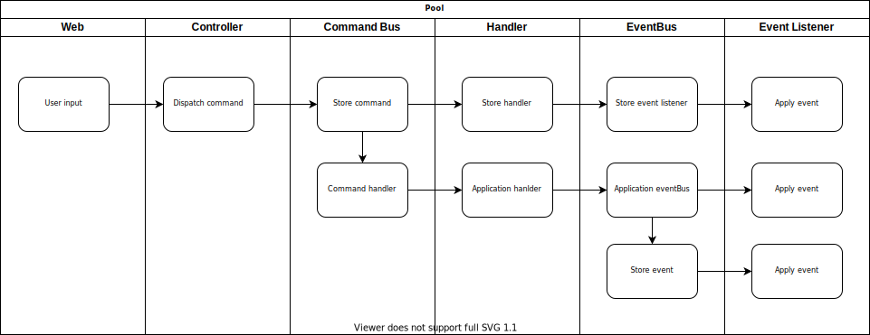

# Laravel event-sourcing

Event sourcing for laravel 8+

# Installation

For now only available on github.

# Project explained

This project is set up for applications that need an audit log trail.

Storing incoming commands and outgoing events you will have an exact trace of how the data in 
the database came to be. In case of data manipulation with replaying the events you should be able to 
return to the correct state for your data.

You will be able to create a script to periodically check your data integrity.

# Data Flow

